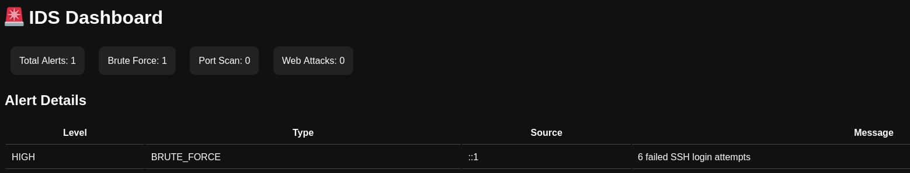

# 🚨 Log-Based Intrusion Detection System (IDS) with Dashboard

## 📌 Overview
This project implements a **Log-Based Intrusion Detection System (IDS)** that monitors Linux system logs and detects suspicious activities using rule-based analysis.

It identifies attack patterns such as brute-force login attempts, suspicious logins, port scanning, and abnormal web activity. A Flask-based dashboard is included to visualize alerts.

---

## 🎯 Features

- 🔐 Brute-force SSH attack detection  
- ⚠️ Suspicious login detection (success after failures)  
- 🌐 Port scan detection  
- 🚫 Excessive HTTP 404 detection  
- 📊 Dashboard for alert visualization  
- 📄 Alerts stored in JSON and log format  
- 🧪 Works with real Linux system logs  

---

## 🛠️ Technologies Used

- Python  
- Flask  
- Regular Expressions (Regex)  
- Linux Log Analysis (`journalctl`)  

---

## ⚙️ How It Works

1. Reads system log files  
2. Extracts IP and events using regex  
3. Counts activity per IP  
4. Applies threshold-based detection  
5. Generates alerts  
6. Saves output to:
   - `ids_alerts.log`
   - `ids_report.json`  
7. Displays alerts in dashboard  

---

## 🚀 How to Run
Run Dashboard
python3 dashboard.py
Open Browser
http://127.0.0.1:5000
🧪 Testing

Tested using:

Simulated brute-force attacks
Real system logs (journalctl)

Detected:

Multiple failed login attempts
Suspicious login after brute-force
📸 Screenshots

📄 Project Report

Download Full Report

📂 Project Structure
log-based-ids-dashboard/
├── log_ids.py
├── dashboard.py
├── templates/
├── screenshots/
├── IDS_Project_Report.pdf
├── ids_alerts.log
├── ids_report.json
🔐 Detection Rules
Attack Type	Description	Severity
Brute Force	Multiple failed SSH login attempts	HIGH
Suspicious Login	Login success after failures	HIGH
Port Scan	Multiple ports accessed	MEDIUM
404 Spike	Excessive HTTP 404 errors	MEDIUM
🧠 Learning Outcomes
Log analysis using Python
Regex-based pattern detection
SOC-style monitoring logic
Building security dashboards
Detecting real-world attack behavior
⚠️ Disclaimer

This project is for educational and defensive security purposes only.

👨‍💻 Author

Azeem Abdulla
Cybersecurity Enthusiast
